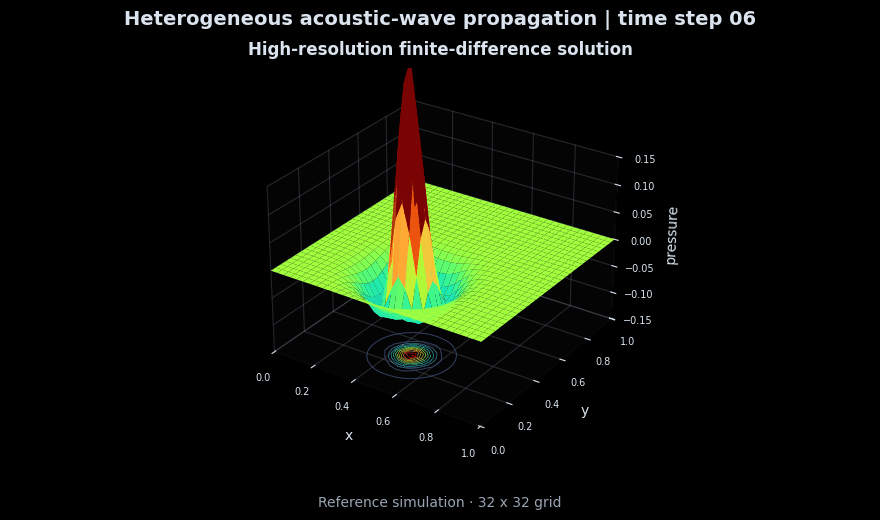
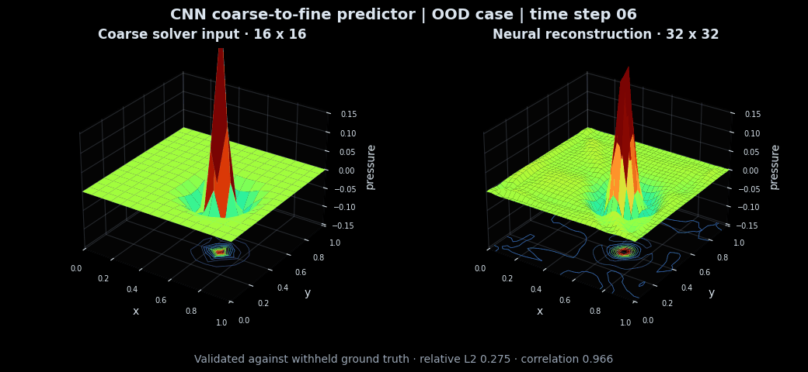

# AI-ML

Applied artificial intelligence and machine learning work covering retrieval, agent systems, model evaluation and scientific machine learning.

## Flagship Project

### [Financial Operations AI](financial-operations-ai)

A financial operations platform that imports invoice documents and bank transactions, suggests payment matches and detects unusual activity.

The system uses a trained invoice classifier, an Isolation Forest anomaly model and a deterministic reconciliation engine. An evidence assistant investigates the results with citations. Financial matches remain suggestions until a named reviewer approves them.

| Evaluation measure | Result |
| --- | ---: |
| Invoice category accuracy | 1.000 |
| Reconciliation precision and recall | 1.000 |
| Anomaly precision and recall | 0.727 / 1.000 |

The evaluation uses the included synthetic dataset with 108 invoices and 110 transactions. The project includes a FastAPI service, PostgreSQL configuration and a Docker setup.

## Scientific Machine Learning

### [WaveOperator Lab](wave-operator-lab)

Physics-informed neural super-resolution for heterogeneous acoustic-wave simulations.

| Smooth reference simulation | Neural coarse-to-fine predictor |
| --- | --- |
|  |  |

The numerical PDE solver originated in coursework. I independently extended it into the machine-learning system shown here to investigate a practical alternative to recomputing every high-resolution PDE case entirely from scratch.

The project combines a parameterized acoustic PDE solver, paired coarse/fine simulation data, a Fourier Neural Operator, a residual CNN, physics-aware training, and held-out/OOD evaluation. It measures whether learned correction can recover high-resolution wave fields from cheap coarse-grid simulations.

| Method | Test relative L2 | OOD relative L2 |
| --- | ---: | ---: |
| Coarse interpolation | 0.4585 | 0.5039 |
| Fourier Neural Operator | 0.3750 | 0.4758 |
| Convolutional baseline | **0.3541** | **0.4309** |

The best reconstruction model reduces held-out error by **22.8%** relative to interpolation alone. The FNO achieves stronger physics and energy consistency while the CNN produces the lowest field error and latency. The repository includes trained checkpoints, sample-level metrics and reproducible experiment configuration.

## Project Archive

- `financial-operations-ai` - invoice processing, payment reconciliation and anomaly investigation.
- `wave-operator-lab` - flagship scientific ML project for physics-informed acoustic-wave super-resolution.
- `rag-agent-evaluation-workbench` - RAG, citation grounding and agent evaluation workbench.
- `ai-internship-intelligence-dashboard` - AI internship ranking dashboard with SQLite analytics, explainable skill matching, charts, and an HTML report.
- `EmanuelsLLM` - small educational language model implementation.
- `ai-engineering-projects` - structured AI engineering practice, including an LLM API chat project.
- `gemini-terminal-agent` - terminal-based Gemini API chat agent with search-grounding work.
- `huggingface-llamaindex-langgraph-learning` - LlamaIndex, LangGraph, RAG, MCP, and workflow practice scripts.
- `mcp-practice-server` - MCP practice server with tools, resources, prompts, and a terminal client.
- `tensorflow-practice` - TensorFlow and scikit-learn practice scripts.
- `edge-ml-tflite-practice` - TFLite and TabPFN model testing practice.
- `edge-optimization-project` - edge AI optimization project with training, conversion, and benchmark scripts.
