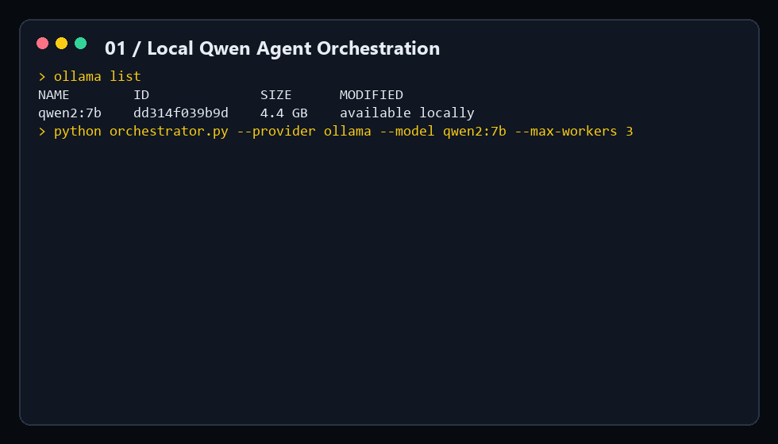
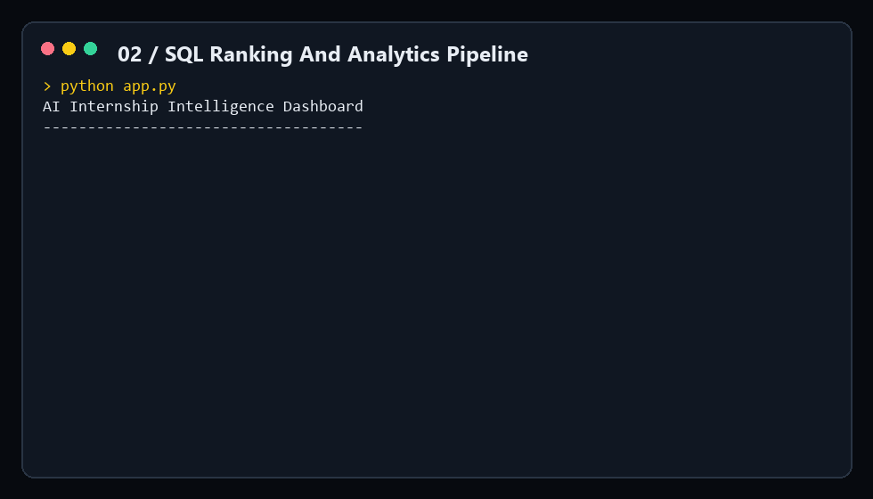
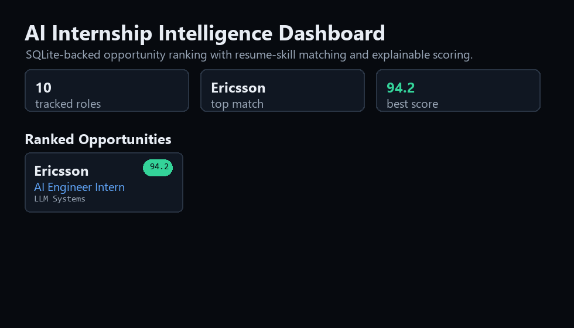

# AI Internship Intelligence Dashboard

Portfolio-ready AI/ML internship ranking dashboard built from structured opportunity data, SQL analytics, and resume-skill matching.

The project is implemented as a compact Python analytics pipeline with structured data, scoring logic, and report output.

## What It Does







- Loads internship opportunities from CSV.
- Stores them in SQLite for repeatable analytics.
- Scores each role against an AI/ML-focused technical profile.
- Ranks opportunities using skill overlap, field relevance, status, salary, and location.
- Generates charts and a polished HTML dashboard.

## Run

```powershell
python app.py
```

Output:

- `reports/internship_intelligence.db`
- `reports/dashboard.html`
- `reports/top_ranked_opportunities.csv`
- `reports/field_summary.csv`
- `assets/field_score.png`
- `assets/status_pipeline.png`

## Demo Focus

This project demonstrates practical AI engineering habits: structured data, explainable scoring, SQL queries, visual reporting, and portfolio packaging.
