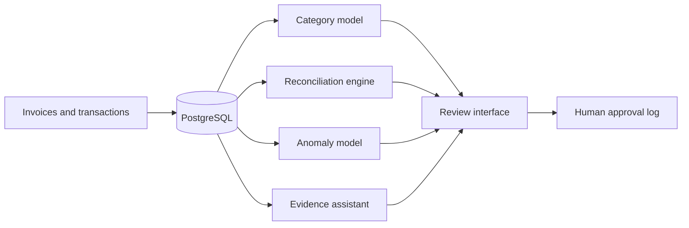

# Financial Operations AI

An operational platform for invoice categorisation, payment reconciliation and anomaly investigation.

The project combines deterministic financial controls with machine learning. It imports company records, invoice documents and bank transactions into PostgreSQL. A review interface presents suggested matches and unusual payments. Every accepted reconciliation requires a named human reviewer.


## Results

The complete pipeline was evaluated on a fixed synthetic dataset with 108 invoices and 110 transactions.

| Measure | Result |
| --- | ---: |
| Invoice extraction field accuracy | 1.000 |
| Invoice category accuracy | 1.000 |
| Reconciliation precision | 1.000 |
| Reconciliation recall | 1.000 |
| Anomaly precision | 0.727 |
| Anomaly recall | 1.000 |
| Assistant citation validity | 1.000 |
| Unsupported question refusal | 1.000 |

The dataset contains three invoice layouts, 84 labelled payment matches and 8 labelled anomalies. These figures describe the included demonstration data. They are not estimates of performance on real financial records. Full results are in [the evaluation report](reports/evaluation.md).

## System



### Invoice Categorisation

A TF IDF representation and logistic regression model classify invoice descriptions into five operating categories. The predicted value is stored next to the source document and expected label.

### Payment Reconciliation

Candidate pairs are scored by amount, payment date and reference agreement. The matching pass selects a unique transaction for each invoice. Results remain suggestions until a reviewer approves them.

### Anomaly Detection

Isolation Forest identifies unusual transaction patterns. Transparent controls also inspect large amounts, unfamiliar counterparties and weekend payments. Each alert stores its score and reasons.

### Evidence Assistant

The assistant retrieves invoices, matches and anomalies before answering. Its offline mode produces cited summaries without an external model. An optional API model can improve the language while remaining restricted to the retrieved evidence.

## Run Locally

```powershell
python -m venv .venv
.\.venv\Scripts\Activate.ps1
python -m pip install -r requirements.txt
python -m scripts.generate_demo_data
python -m scripts.load_demo
uvicorn app.main:app --reload
```

Open `http://127.0.0.1:8000`.

## Run With PostgreSQL

```powershell
copy .env.example .env
docker compose up --build -d
docker compose exec api python -m scripts.load_demo
```

The API and interface run at `http://127.0.0.1:8000`. Interactive API documentation is available at `/docs`.

## Optional Model Provider

Set these values in `.env` to use an OpenAI compatible chat endpoint:

```text
LLM_API_KEY=your_key
LLM_BASE_URL=https://openrouter.ai/api/v1
LLM_MODEL=your_model
```

Without these values, the evidence assistant uses its deterministic mode.

## Evaluate

```powershell
python -m pytest -q
python -m scripts.evaluate
```

The evaluation recreates the database, runs the full analysis and writes measured results under `reports/`.

## Repository Structure

```text
app/          API, database models, services and interface
data/demo/    deterministic synthetic evaluation data
docs/         architecture and data model
reports/      measured evaluation results
scripts/      dataset, loading and evaluation commands
tests/        processing, API and safety tests
```

See [the architecture document](docs/architecture.md) for the processing flow and approval boundary.

