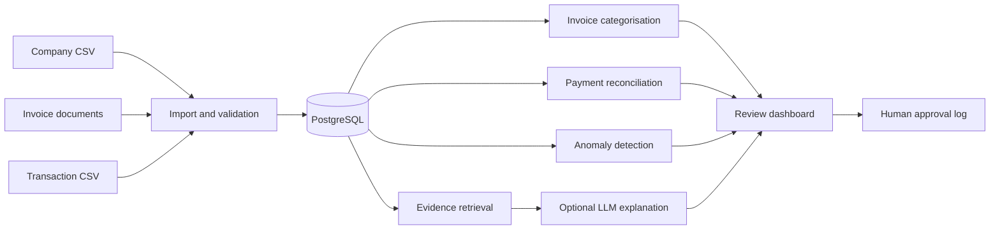
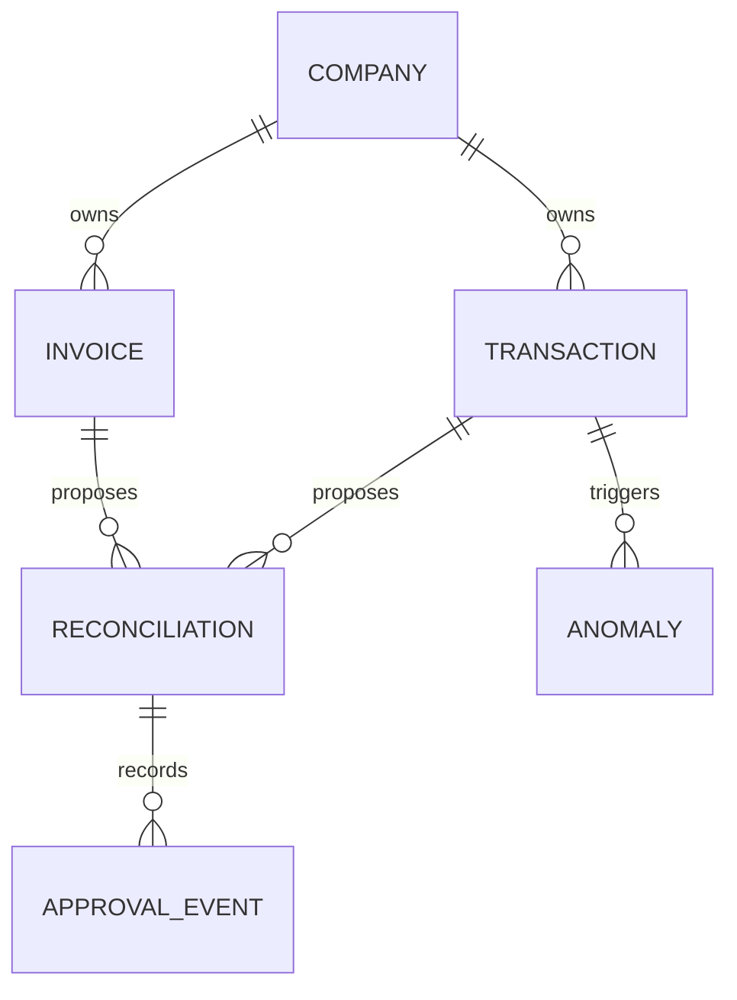

# Architecture

## Processing Flow

The import layer parses three invoice layouts and validates required fields before storage. Invoice categories come from a TF IDF and logistic regression pipeline. Reconciliation scores amount, date and reference agreement. Anomaly detection combines Isolation Forest output with transparent amount and counterparty rules.

The assistant retrieves database records before producing an answer. It works without an external model through deterministic summaries. When an API model is configured, the same evidence is placed in a restricted prompt. The assistant cannot approve a reconciliation.

## Data Model

`Company`, `Invoice` and `Transaction` hold imported facts. `Reconciliation` and `Anomaly` hold model output. `ApprovalEvent` stores the reviewer, action and timestamp for each accepted match.

## Decision Boundary

Models suggest categories, matches and anomalies. The application does not execute payments or change accounting records. A reconciliation remains `suggested` until a named reviewer approves it. The approval is written to a separate audit table.

## Provider Boundary

The core calculations do not depend on an LLM. Optional model access uses an OpenAI compatible endpoint configured through environment variables. Keys remain outside source control.

