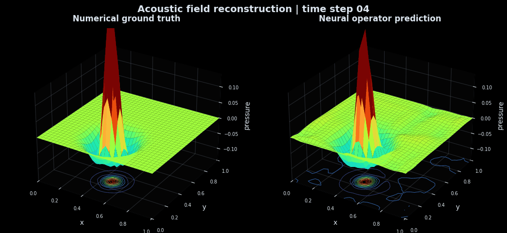
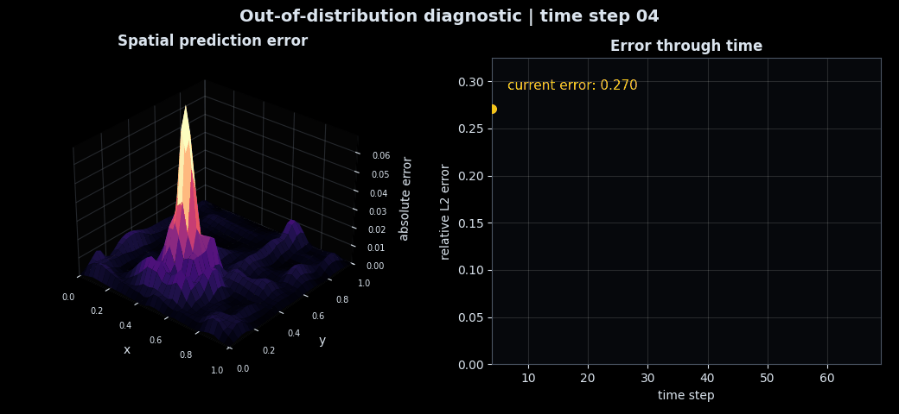
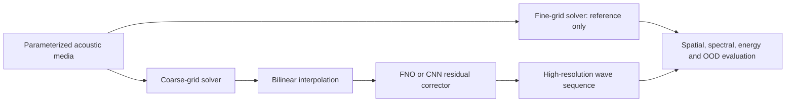

# WaveOperator Lab

Physics-informed neural super-resolution for heterogeneous acoustic-wave simulations.

| High-resolution reconstruction | Out-of-distribution error analysis |
| --- | --- |
|  |  |

## Project Origin

The acoustic finite-difference solver originated in numerical PDE coursework. I independently extended that foundation into a scientific machine-learning study after identifying a practical opportunity: a learned correction model can reconstruct a fine wave field from a cheaper coarse simulation instead of requiring every high-resolution configuration to be computed entirely from scratch.

The neural super-resolution pipeline, Fourier Neural Operator and CNN comparison, physics-aware objective, out-of-distribution evaluation, benchmark reports, and interactive dashboard were developed as that extension beyond the original coursework.

## Objective

High-resolution partial differential equation simulations can become expensive as spatial resolution, geometric complexity, and parameter sweeps grow. This project tests a hybrid scientific machine-learning approach:

1. Run the acoustic wave equation on a cheap `16 x 16` grid.
2. Interpolate the coarse trajectory to `32 x 32`.
3. Use a learned operator to reconstruct the high-resolution wave field.
4. Penalize data error, spatial-gradient error, and violation of the discrete wave equation.
5. Evaluate ordinary test cases and harder media outside the training distribution.

The fine-grid solver is used as ground truth during training and evaluation. It is not provided to the model at inference time.

## Results

| Method | Test relative L2 | OOD relative L2 | Test correlation | OOD correlation |
| --- | ---: | ---: | ---: | ---: |
| Coarse interpolation | 0.4613 | 0.5086 | 0.8762 | 0.8526 |
| Fourier Neural Operator | 0.3759 | 0.4770 | 0.9032 | 0.8680 |
| Convolutional baseline | **0.3542** | **0.4292** | **0.9119** | **0.8874** |

The convolutional model reduces reconstruction error by **23.2%** on the held-out test split and **15.6%** on the harder out-of-distribution split relative to interpolation alone. The Fourier Neural Operator produces the lower physics residual and substantially better energy consistency, exposing a useful accuracy-versus-physics tradeoff rather than a single cherry-picked score.

Full measurements are in [the benchmark report](reports/benchmark.md), with sample-level results in [`evaluation_samples.csv`](reports/evaluation_samples.csv).

## System



The simulated equation is

```math
\frac{\partial^2 p}{\partial t^2} = c(x,y)^2 \nabla^2 p,
```

where `p` is acoustic pressure and `c(x,y)` is a heterogeneous wave-speed field. The reference solver uses a second-order finite-difference update, a zero-velocity initial condition, and a damped boundary layer.

The neural objective combines weighted field reconstruction, spatial-gradient agreement, and a discrete physics residual:

```math
\mathcal{L}=\mathcal{L}_{field}+\lambda_p\mathcal{L}_{physics}+\lambda_g\mathcal{L}_{gradient}.
```

## Evaluation Design

- Deterministic train, validation, test, and OOD splits
- Random smooth heterogeneous media and localized initial-pressure sources
- OOD cases with stronger contrasts, additional inclusions, and unseen material layers
- Fourier Neural Operator versus a compact residual CNN
- Uncorrected coarse interpolation as the required baseline
- Relative L2, RMSE, correlation, spectral error, energy error, physics residual, parameter count, checkpoint size, and CPU latency
- Validation-only checkpoint selection

The current small-grid CPU benchmark does not show a runtime advantage over the vectorized finite-difference solver. Component timings are reported directly instead of presenting a misleading speedup claim. The experiment is structured for higher-resolution and GPU studies where the computational tradeoff changes.

## Run

```powershell
python -m venv .venv
.\.venv\Scripts\Activate.ps1
python -m pip install -r requirements.txt
python run_pipeline.py
```

Run only the evaluation after checkpoints are available:

```powershell
python run_pipeline.py --skip-training
```

Launch the interactive comparison dashboard:

```powershell
streamlit run dashboard.py
```

Run the test suite:

```powershell
python -m unittest discover -s tests -v
```

## Repository Structure

```text
wave-operator-lab/
|-- configs/                 experiment configuration
|-- wave_operator/           physics, data, models, losses and evaluation
|-- tests/                   numerical and ML pipeline tests
|-- artifacts/               trained checkpoints and learning curves
|-- reports/                 aggregate and sample-level benchmarks
|-- assets/                  comparison and diagnostic visuals
|-- train.py                 deterministic model training
|-- evaluate.py              held-out and OOD evaluation
|-- dashboard.py             interactive model inspection
`-- run_pipeline.py          complete experiment entry point
```

## Research Context

The project follows the operator-learning direction introduced by the [Fourier Neural Operator](https://arxiv.org/abs/2010.08895), the use of governing equations as supervision explored in [Physics-Informed Neural Operators](https://arxiv.org/abs/2111.03794), and the multi-metric benchmarking principles represented by [PDEBench](https://arxiv.org/abs/2210.07182).

See [MODEL_CARD.md](MODEL_CARD.md) for scope, limitations, and intended use.
